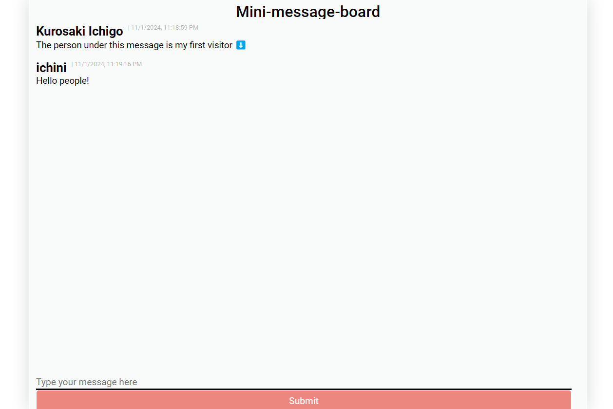

<div align="center">
	<br />
	<p>
		<a href="#"></a>
	</p>
	<br />
    <h1>Mini-Message Board</h1>
    <a href="https://mini-message-board-production-d510.up.railway.app/">Try it here!</a>
</div>

## Screenshot



## About

This is a simple mini-message board node application for The Odin Project.

## Tools/Language

- Nodejs
- Express
- store2

## Want to clone and customize?

You need to create a `.env` file in your root directory for the following:

```js
PORT=<local_port>
```

### Usage

1. Clone this repo

```bash
npm install
```

2. Run the command deployment

```bash
npm run start
```

## Contributing

Pull requests are welcome. For major changes, please open an issue first
to discuss what you would like to change.

Please make sure to update tests as appropriate.
